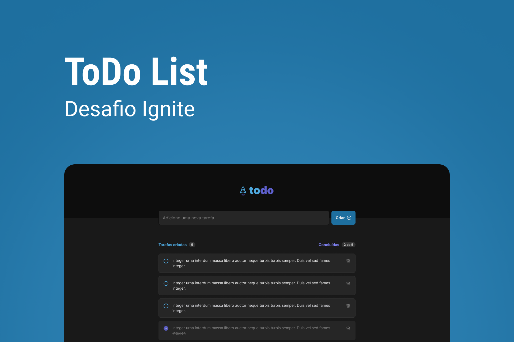

<p align="center">
    
</p>

<h3 align="center">
  Aplicação de ToDo desenvolvida como desafio do programa Ignite da @Rocketseat
</h3>

<p align="center">
    
    
    <a href="https://github.com/KassiaMabily/IgniteToDo/commits/main">
      
    </a>
</p>

<h4 align="center">
	🚧 Finished 🚧
</h4>

<p align="center">
    <a href="#about">About</a> •
    <a href="#features">Features</a> •
    <a href="#how-it-works">How it works</a> •
    <a href="#tech-stack">Tech Stack</a> •
    <a href="#author">Authors</a> •
    <a href="#user-content-license">License</a>
</p>

## 💻 Overview




---
## ✅ Features


- [ ] Create a new Task
- [ ] Mark and unmark a task as complete
- [ ] Remove a task from the list
- [ ] Show task completion progress

---

## ⚙️ How it works

...

### 👉 Pre-requisites

Before you begin, you will need to have the following tools installed on your machine:
[Git](https://git-scm.com), [npm](https://www.npmjs.com/)
In addition, it is good to have an editor to work with the code like [VSCode](https://code.visualstudio.com/).

### 👉 Run project
```bash

# Clone this repository
$ git clone https://github.com/KassiaMabily/IgniteToDo.git

# go to the project folder
$ cd IgniteToDo

# install modules
$ npm install

# run
$ npm run dev

```

## 🚀 Tech Stack

The following tools were used in the construction of the project:

-   **[Vite](https://vitejs.dev/)**
-   **[ReactJS](https://pt-br.reactjs.org/)**
-   **[Typescript](https://www.typescriptlang.org/)**

---

## Authors
<table>
    <tr>
    <td align="center">
        <p>
            <a href="#">
                
                <br />
                <sub><b>Kassia Fraga</b></sub></a><a href="#" title="Kassia Fraga">
            </a>
            <br/>

[](https://www.linkedin.com/in/kassia-fraga/)
[](https://www.instagram.com/dev.naotaosedentaria/)
[](mailto:kassiafraga7@gmail.com)
        </p>
    </td>
    </tr>
</table>
